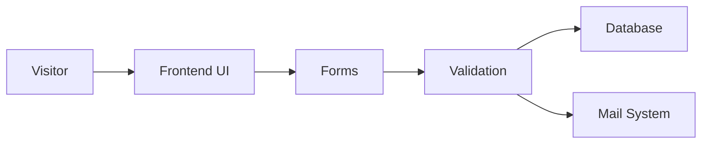

<div align="center">
  

  <h1>360 Properties Hub</h1>

  <p>
    <strong>
    A high-performance, enterprise-grade real estate compliance and advisory platform 
    built with Laravel, designed to handle property regulations, inquiries, and SEO-driven growth.
    </strong>
  </p>

  <p>
    <a href="https://laravel.com"></a>
    
    
    
    
  </p>

  <p>
    <a href="#quick-start">Quick Start</a> •
    <a href="#features">Features</a> •
    <a href="#routes">Routes</a> •
    <a href="#project-structure">Structure</a> •
    <a href="#deployment-checklist">Deploy</a>
  </p>
</div>

---

## 🚀 Overview

**360 Properties Hub** is a full-stack Laravel platform designed for real estate compliance, legal advisory, approvals, taxation, and property consulting services.

It combines a conversion-focused frontend with a powerful backend system to handle:

* Client inquiries
* Regulatory workflows
* SEO optimization
* Lead generation

This platform is tailored for property owners, developers, investors, NRIs, and businesses operating in West Bengal.

---

## 💼 Why This Project Matters

✔ Handles complex real estate regulatory workflows
✔ Built for high lead conversion
✔ SEO-optimized for organic growth
✔ Scalable Laravel architecture
✔ Real-world business use-case (not a demo project)

This is not just a website — it's a complete business system.

---

## ⚙️ Project Snapshot

| Area      | Details                                         |
| --------- | ----------------------------------------------- |
| Framework | Laravel 12                                      |
| Runtime   | PHP 8.2+                                        |
| Frontend  | Blade, Vite 6, Tailwind CSS 4                   |
| Database  | SQLite (default), MySQL/PostgreSQL supported    |
| SEO       | Meta tags, Open Graph, structured data, sitemap |
| Forms     | Contact, Service Inquiry, Expert Consultation   |
| Security  | CSRF, Validation, reCAPTCHA                     |
| Email     | Customer & Admin notifications                  |

---

## ✨ Features

### Customer Experience

* Modern responsive UI
* Service-based landing pages
* Blog system for SEO growth
* Contact & inquiry system

### Inquiry System

* Contact form storage
* Service inquiry tracking
* Expert consultation module
* Email notifications (Admin + User)
* reCAPTCHA protection

### SEO & Growth

* Dynamic meta tags
* Open Graph integration
* XML sitemap generation
* Robots.txt optimization

---

## 🧠 Architecture



---

## 🛠 Tech Stack

* Laravel 12
* PHP 8.2+
* Blade + Vite
* Tailwind CSS
* MySQL / SQLite
* Laravel Mail
* reCAPTCHA

---

## ⚡ Quick Start

```bash
git clone https://github.com/your-username/360-business-services.git
cd 360-business-services
composer install
npm install
cp .env.example .env
php artisan key:generate
php artisan migrate
npm run dev
php artisan serve
```

---

## 📁 Project Structure

```text
app/
resources/
routes/
public/
database/
```

---

## 🚀 Deployment Checklist

* Set APP_ENV=production
* Set APP_DEBUG=false
* Configure database
* Setup mail credentials
* Setup reCAPTCHA
* Run migrations
* Build assets

---

## 👨‍💻 Developed By

**Rittik Sadhukhan**
Full Stack Developer (Laravel | Business Systems)

---

## 🚫 Copyright & Usage

© 2026 Rittik Sadhukhan. All rights reserved.

This project is proprietary software developed for a specific client.

You are NOT allowed to:

* Copy this code
* Modify or reuse this project
* Distribute this code

Without explicit written permission.

---

<div align="center">
  <strong>Built with precision for real-world business impact.</strong>
</div>
