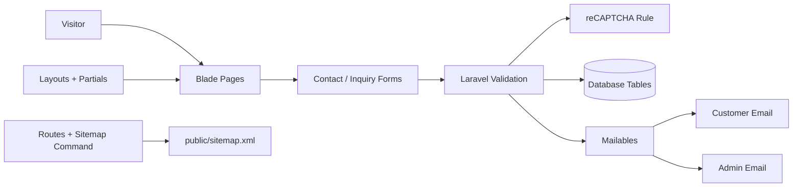

<div align="center">
  

  <h1>360 Properties Hub</h1>

  <p>
    <strong>A Laravel-powered real estate compliance, advisory, SEO, and inquiry platform for property services in Kolkata and West Bengal.</strong>
  </p>

  <p>
    <a href="https://laravel.com"></a>
    
    
    
    
  </p>

  <p>
    <a href="#quick-start">Quick Start</a> •
    <a href="#features">Features</a> •
    <a href="#routes">Routes</a> •
    <a href="#project-structure">Structure</a> •
    <a href="#deployment-checklist">Deploy</a>
  </p>
</div>

---

## Overview

**360 Properties Hub** is a full-stack Laravel website for real estate legal, compliance, approval, taxation, valuation, and advisory services. It combines a polished public-facing Blade experience with inquiry capture, reCAPTCHA validation, email notifications, blog pages, service landing pages, structured SEO metadata, and sitemap generation.

The platform is designed for property owners, developers, investors, NRIs, and businesses looking for regulatory support across authorities such as HIDCO, NKDA, WEBEL, NDITA, KMC, UD departments, RERA, and related real estate bodies.

## Project Snapshot

| Area | Details |
| --- | --- |
| Framework | Laravel 12 |
| Runtime | PHP 8.2+ |
| Frontend | Blade, Vite 6, Tailwind CSS 4, Bootstrap/theme assets |
| Database | SQLite by default, MySQL/PostgreSQL compatible |
| SEO | Meta sections, Open Graph data, structured data partial, robots files, XML sitemap |
| Forms | Contact form, service inquiry form, expert solution modal |
| Security | CSRF protection, Laravel validation, Eloquent ORM, reCAPTCHA rule for inquiry flows |
| Email | Customer acknowledgements and admin notifications via Laravel Mailables |
| Sitemap | `spatie/laravel-sitemap` with command, controller endpoint, and admin view |

## Features

### Customer Experience

- Homepage for complete property compliance and consultancy positioning.
- Dedicated service pages for approvals, legal, taxation, investment, valuation, registration, and regulatory support.
- Blog section for real estate compliance, portfolio, taxation, and DPR insights.
- Contact page and modal-based inquiry flows.
- Mobile-responsive Blade layout with shared header, footer, and reusable components.

### Inquiry Engine

- General contact submissions stored in `contacts`.
- Service sidebar inquiries stored in `contact_inquiries`.
- Expert consultation requests stored in `expert_queries`.
- AJAX-friendly JSON responses for interactive forms.
- Customer greeting emails and admin notification emails.
- reCAPTCHA verification through `App\Rules\RecaptchaRule` and `App\Services\RecaptchaService`.

### SEO & Growth

- Page-level titles, descriptions, keywords, canonical URLs, and Open Graph values.
- Structured data partial for rich search context.
- Public `robots.txt` and production robots configuration.
- XML sitemap generation through Artisan and web endpoints.
- Prioritized routes for service categories and blog pages.

### Admin Utilities

- Expert query listing at `/admin/expert-queries`.
- Sitemap management view at `/admin/sitemap`.
- Sitemap generation endpoint at `/generate-sitemap`.

> Note: Admin route protection should be reviewed before production launch if these URLs are exposed publicly.

## Architecture



## Tech Stack

| Layer | Tools |
| --- | --- |
| Backend | Laravel 12, PHP 8.2+, Laravel Mail, Artisan commands |
| Frontend | Blade templates, Vite, Tailwind CSS, Bootstrap, Swiper, GSAP, Font Awesome assets |
| Database | SQLite for local setup, MySQL/PostgreSQL ready via `.env` |
| SEO | Spatie Sitemap, structured data, Open Graph, robots files |
| Testing & Quality | PHPUnit, Laravel test runner, Laravel Pint |

## Requirements

- PHP 8.2 or newer
- Composer
- Node.js 18 or newer
- npm
- SQLite, MySQL, or PostgreSQL
- Git

## Quick Start

### 1. Clone The Repository

```bash
git clone https://github.com/Astarand/360-propertieshub.git
cd 360-propertieshub
```

### 2. Install Dependencies

```bash
composer install
npm install
```

### 3. Create Environment File

Windows PowerShell:

```powershell
Copy-Item .env.example .env
```

macOS/Linux:

```bash
cp .env.example .env
```

### 4. Generate App Key

```bash
php artisan key:generate
```

### 5. Configure Database

The project can run locally with SQLite. Make sure this value exists in `.env`:

```env
DB_CONNECTION=sqlite
```

For MySQL, use:

```env
DB_CONNECTION=mysql
DB_HOST=127.0.0.1
DB_PORT=3306
DB_DATABASE=360_properties
DB_USERNAME=root
DB_PASSWORD=
```

Then run migrations:

```bash
php artisan migrate
```

### 6. Configure Mail & reCAPTCHA

Add the values used by the inquiry controllers and reCAPTCHA service:

```env
MAIL_MAILER=smtp
MAIL_HOST=your-mail-host
MAIL_PORT=587
MAIL_USERNAME=your-mail-username
MAIL_PASSWORD=your-mail-password
MAIL_FROM_ADDRESS=contact@360propertieshub.com
MAIL_FROM_NAME="360 Properties Hub"

ADMIN_EMAIL=contact@360propertieshub.com
RECAPTCHA_SITE_KEY=your-site-key
RECAPTCHA_SECRET_KEY=your-secret-key
```

### 7. Run The App

Run Laravel and Vite separately:

```bash
php artisan serve
npm run dev
```

Or use the bundled Composer development script:

```bash
composer run dev
```

The app will be available at:

```text
http://127.0.0.1:8000
```

## Useful Commands

| Task | Command |
| --- | --- |
| Start Laravel server | `php artisan serve` |
| Start Vite dev server | `npm run dev` |
| Run full dev stack | `composer run dev` |
| Build frontend assets | `npm run build` |
| Run tests | `php artisan test` |
| Run Composer test script | `composer run test` |
| Format PHP code | `vendor/bin/pint` |
| Show routes | `php artisan route:list` |
| Clear caches | `php artisan optimize:clear` |
| Generate sitemap | `php artisan sitemap:generate` |

## Routes

### Core Pages

| URL | Route Name | Controller |
| --- | --- | --- |
| `/` | `home` | `HomeController@Index` |
| `/about-us` | `about` | `HomeController@About` |
| `/property-deal` | `properties` | `HomeController@Properties` |
| `/approval-and-nocs` | `approveal` | `HomeController@Approveal` |
| `/architecture-and-structural` | `architecture` | `HomeController@Architecture` |
| `/nri-service` | `nri-service` | `HomeController@NRIService` |
| `/success-stories` | `projects` | `HomeController@Projects` |
| `/contact-us` | `contact` | `HomeController@Contact` |

### Form Endpoints

| Method | URL | Purpose |
| --- | --- | --- |
| `POST` | `/contact-us` | Save general contact request and send emails |
| `POST` | `/service-inquiry` | Save service page inquiry with reCAPTCHA |
| `POST` | `/expert-solution` | Save expert solution query with reCAPTCHA |

### SEO & Admin

| URL | Purpose |
| --- | --- |
| `/sitemap.xml` | Serve generated XML sitemap |
| `/generate-sitemap` | Generate sitemap through controller |
| `/admin/sitemap` | Sitemap management view |
| `/admin/expert-queries` | Paginated expert query listing |

## Service Coverage

| Category | Services |
| --- | --- |
| Regulatory & Approvals | HIDCO, NKDA, WEBEL, NDITA, KMC, UD permissions, environmental clearance, RERA, building plan approval, Fire NOC, government liaison |
| Legal & Documentation | Due diligence, title verification, registration support, legal drafting, dispute resolution, litigation, legal audit, contract review, valuation, JV documentation |
| Business & Investment | Business mall setup, NRI property services, trade license, DPR, completion certificate, corporate property consulting, investment advisory, tax advisory, portfolio management, real estate structuring |

## Data Model

| Model | Table | Purpose |
| --- | --- | --- |
| `Contact` | `contacts` | General contact form submissions |
| `ContactInquiry` | `contact_inquiries` | Service-specific inquiries with source page URL |
| `ExpertQuery` | `expert_queries` | Expert consultation requests |
| `User` | `users` | Laravel user model for authentication-ready workflows |

## Project Structure

```text
360Properties/
├── app/
│   ├── Console/Commands/          # Sitemap generation command
│   ├── Http/Controllers/          # Page, inquiry, blog, service, sitemap controllers
│   ├── Mail/                      # Customer/admin email notifications
│   ├── Models/                    # Eloquent models
│   ├── Rules/                     # Custom validation rules
│   └── Services/                  # reCAPTCHA service
├── database/
│   ├── migrations/                # Core app tables
│   ├── factories/                 # Test factories
│   └── seeders/                   # Seed data
├── public/
│   ├── assets/                    # CSS, JS, fonts, images, logos
│   ├── robots.txt
│   └── sitemap.xml
├── resources/
│   ├── css/
│   ├── js/
│   └── views/
│       ├── Layouts/               # Base layout
│       ├── Pages/                 # Public pages, services, blogs, other pages
│       ├── Partials/              # Header, footer, structured data
│       ├── components/            # Reusable UI components
│       └── emails/                # Email templates
├── routes/
│   ├── web.php
│   └── console.php
├── tests/
├── composer.json
├── package.json
└── vite.config.js
```

## Sitemap Workflow

Generate the sitemap manually:

```bash
php artisan sitemap:generate
```

The command writes to:

```text
public/sitemap.xml
```

The scheduler is configured in `routes/console.php` to run sitemap generation daily at `02:00`.

For server cron, configure Laravel's scheduler:

```bash
* * * * * cd /path/to/360Properties && php artisan schedule:run >> /dev/null 2>&1
```

## Deployment Checklist

- Set `APP_ENV=production`.
- Set `APP_DEBUG=false`.
- Set `APP_URL=https://360propertieshub.com`.
- Configure production database credentials.
- Configure SMTP credentials and `ADMIN_EMAIL`.
- Add valid `RECAPTCHA_SITE_KEY` and `RECAPTCHA_SECRET_KEY`.
- Run `php artisan migrate --force`.
- Run `npm run build`.
- Run `php artisan config:cache`.
- Run `php artisan route:cache`.
- Run `php artisan view:cache`.
- Generate sitemap with `php artisan sitemap:generate`.
- Ensure admin routes are protected before public deployment.

## Quality Checklist

Before shipping changes:

```bash
php artisan test
vendor/bin/pint
npm run build
php artisan route:list
```

## Environment Notes

The current `.env.example` is optimized for local development with SQLite, database-backed sessions, database queue, and log mail. Production deployments should use real database, queue, cache, mail, and reCAPTCHA credentials.

## Contact

| Channel | Link |
| --- | --- |
| Website | [360propertieshub.com](https://360propertieshub.com) |
| Email | [contact@360propertieshub.com](mailto:contact@360propertieshub.com) |
| Instagram | [@360propertieshub](https://www.instagram.com/360propertieshub/) |

## License

This project is released under the MIT license as declared in `composer.json`.

---

<div align="center">
  <strong>360 Properties Hub</strong><br>
  Complete property compliance, legal, and advisory solutions.
</div>
